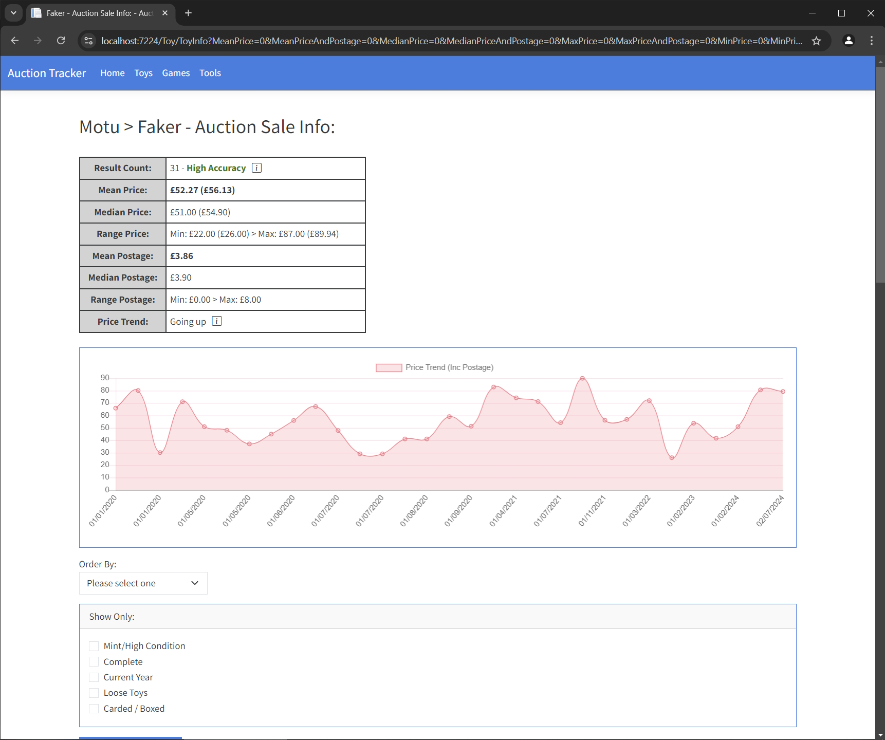
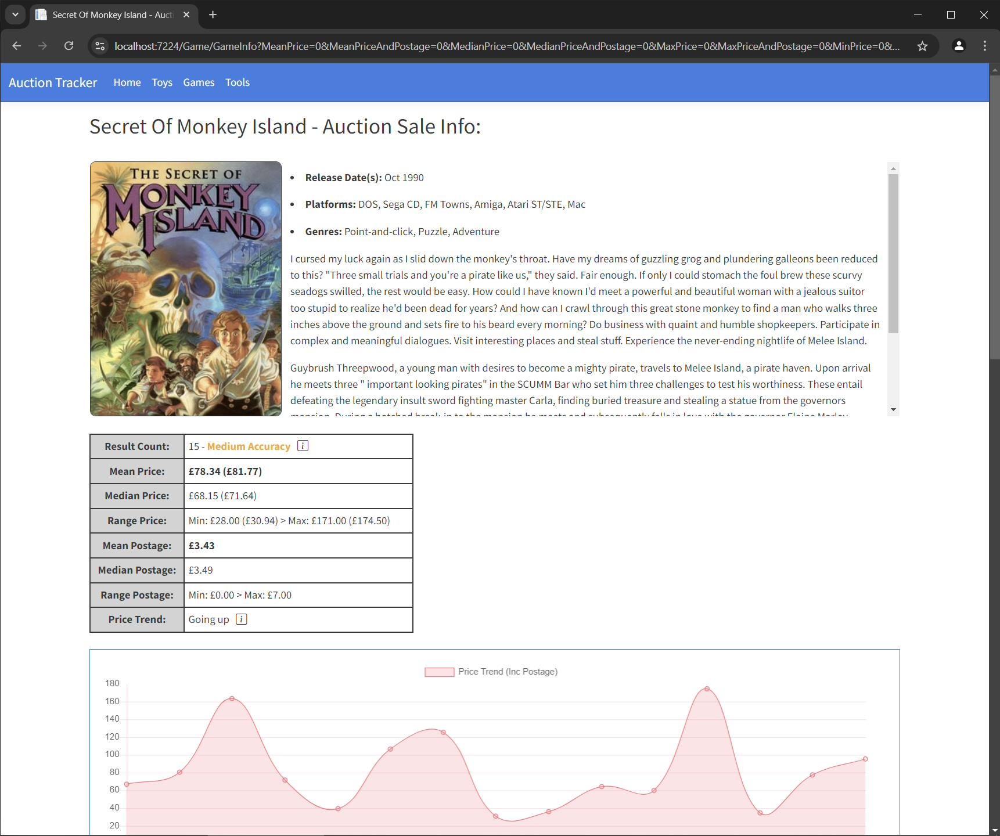
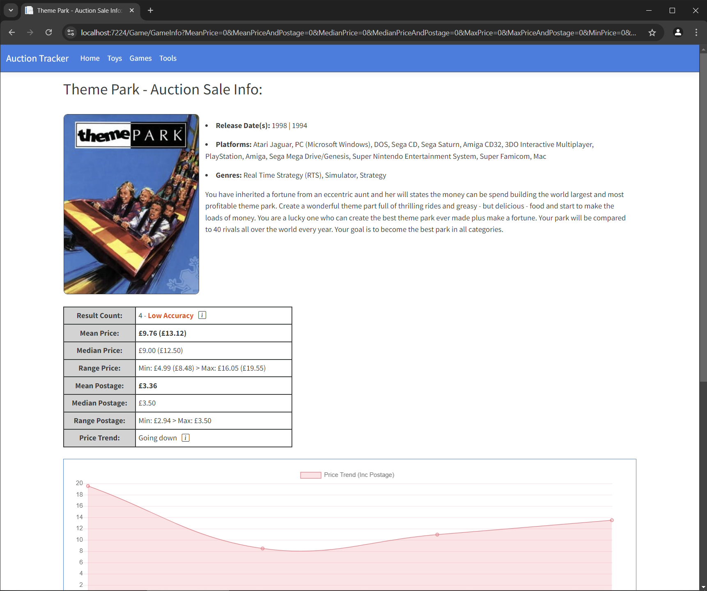
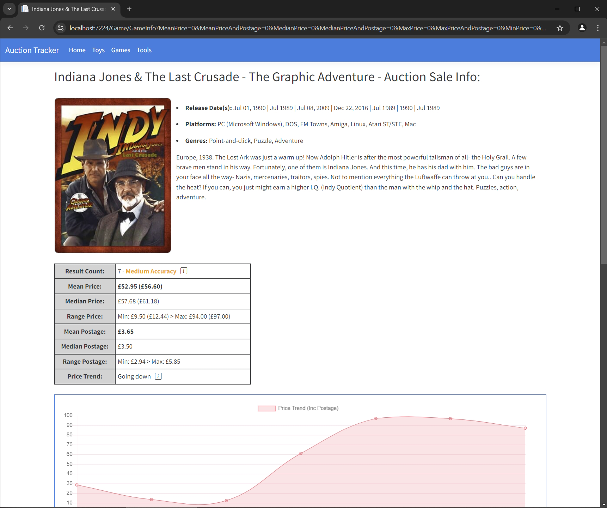
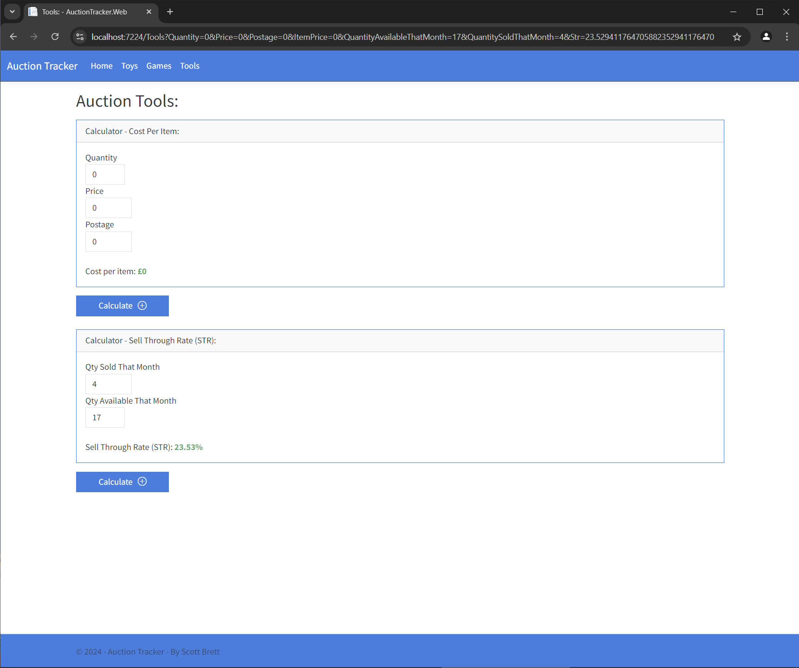

-----------------------------------------
eBay Auction Tracker - About:
-----------------------------------------

The purpose of this project was to achieve two goals:

1)

Learn ASP.NET Core and put into practice and expand on some of the principles I had learnt from training videos.

2)

Create a programmatic solution to a spreadsheet I had been using for several years to catalogue the prices for various vintage items sold on eBay.  A programmatic solution would not offer me a quick solution to the problem but It would provide me the opportunity to add in more powerful features and a nicer user interface.

Technologies / Principles Used:

- C#
- JavaScript
- JQuery
- ASP.NET MVC Core
- CSS / Bootstrap Themes & Icons
- Chart.js
- REST
- IGDB API (Via my own wrapper, project 'IgdbApi.Lib')
- RestSharp
- Newtonsoft.Json
- Entity Framework - Code first approach
- SQL Server Express backend database
- TDD (Microsoft Test Framework + Fluent Assertion)

Requirements:

- SQL backend database to be installed, refer to '\Resources\AuctionDb.bak'
- Signup to 'Twitch developer portal' to aquire 'clientId' and 'clientSecret' to use the IGDB API functionality in this program, refer to https://api-docs.igdb.com/#authentication

Resources / Credits:

- https://getbootstrap.com/docs/5.3/getting-started/introduction/
- https://icons.getbootstrap.com/
- https://bootswatch.com/cosmo/
- Original Traning Video - https://www.youtube.com/watch?v=hZ1DASYd9rk&list=WL&index=7
- Chart training example - https://www.c-sharpcorner.com/article/creating-charts-with-asp-net-core/
- Refer to the location '\Resources\AuctionDb.bak' in the code for a backup copy of the SQL database (Test Version).
- https://www.igdb.com/
- https://api-docs.igdb.com/#authentication

Image Credits:

Credit to the below site(s) for images used in this application.

- https://retromash.com/2015/01/30/top-ten-action-figure-toylines/

Images:

